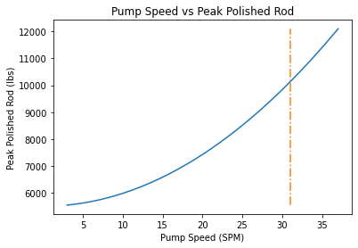
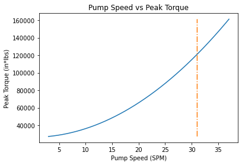
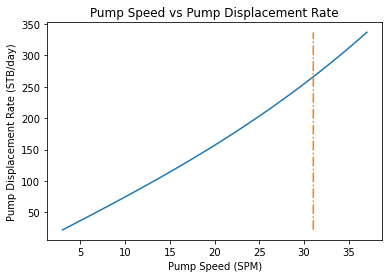
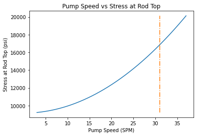

# Pump Analysis

This Python script conducts an analysis of a pump system used in oil production. It calculates various parameters and plots graphs to visualize the relationship between pump speed and different performance metrics. Below is a detailed description of the script and its functionalities.

## Requirements

To run the script, ensure you have the following libraries installed:

- `numpy`
- `matplotlib`
- `math`

## Script Overview

The script begins by defining various parameters related to the pump system. These parameters include dimensions, fluid properties, reservoir conditions, pump unit specifications, and other relevant constants.

### Parameters

- **Dimensions and Properties**:
  - `a` to `g`: Constants that may be adjusted according to specific requirements.
  - `tubing_head`, `bubble_point`, `plunger_diameter`, `tubing_OD`, `tubing_ID`: Geometric dimensions and properties related to the tubing and plunger.
  - `bo`, `bw`, `sg_water`, `fs`, `steel_density`, `em`, `gl`, `volumetric_efficiency`: Properties related to fluid, material, and pump efficiency.
  - `perforation_depth`, `reservoir_pressure`, `productivity_index`, `API`, `water_cut`, `X`, `L`: Parameters related to reservoir and well conditions.

- **Rod and Pump Unit Specifications**:
  - `rod_number`, `first_rod_diameter`, `second_rod_diameter`: Rod specifications including number and diameter.
  - `peak_torque`, `peak_polished`, `max_stroke_length`, `c_list`, `D1`, `D2`, `Cs`, `h`: Pump unit specifications including torque, stroke length, and dimensions.

### Calculations

The script then performs calculations based on the provided parameters. It calculates various factors including fluid densities, areas, weights, stress, torque, and oil production rates. The calculations involve complex equations that model the behavior of the pump system under different conditions.

### Results

The script computes the peak polished rod, peak torque, stress at the rod top, pump displacement rate, and oil production rate for different pump speeds. It identifies the optimum pump speed and production rate based on the calculated metrics.

### Graphs

Finally, the script generates graphs to visualize the relationship between pump speed (SPM - Strokes Per Minute) and different performance metrics such as peak torque, peak polished rod, stress at rod top, pump displacement rate, and oil production rate. These graphs help in understanding how varying pump speed affects the pump system's performance.

## Example Graphs

## Running the Script

To run the script, simply execute it in a Python environment with the required libraries installed. Adjust the parameters as necessary for your specific pump system analysis.

## Conclusion

This script provides valuable insights into the performance characteristics of a pump system used in oil production. By analyzing various parameters and plotting corresponding graphs, it aids in understanding the behavior of the pump under different operating conditions.

## Credits

This script was developed by Toghrul Nasirli.